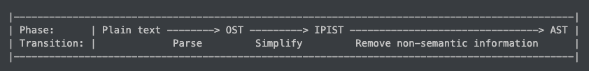

# Glossary

Here are some phrases and abbreviations
we use when talking about Zo.
The definitions are not guaranteed to agree
with the ordinary definitions.

- app: (function) application
- AST: abstract syntax tree
- deb: De Bruijn index
- digest: the output of a hash algorithm.
  Unless otherwise specified, "digest" refers to
  a SHA256 digest.
- ind: inductive data type definition
- IPIST: information-preserving intermediate syntax tree.
  This is an intermediate representation of the OST.

  It is "information-preserving" in the sense that
  there is a one-to-one correspondence between OSTs and IPISTs.
  This implies that you can _always_
  reconstruct an OST from an IPIST.

- OST: original syntax tree.
  The parser constructors this tree.
  The tree is later converted into an IPIST,
  and then into an AST.
- RC: reference counted
- scon: substitution context
- sem hash: semantic hash
- tcon: type context
- vcon: variant constructor

## Pronunciation of fully capitalized phrases

You should read the fully capitalized phrases using their individual letters.
For example, you read "AST" as "ay ess tee".
As another example, you read "OST" as "oh ess tee".

**There is one exception: "IPIST".**
You should read "IPIST" as "eye pissed".

## Pronunciation of scon, tcon, and vcon

- "ess con"
- "tee con"
- "vee con"

In general, the first letter is pronounced as a letter.
The "con" is pronounced like the English word (e.g., as in "pros and cons").

## Syntax tree progression

Here is an ASCII diagram:

```plaintext
|-----------------------------------------------------------------------------------------------|
| Phase:      | Plain text --------> OST ---------> IPIST --------------------------------> AST |
| Transition: |             Parse         Simplify         Remove non-semantic information      |
|-----------------------------------------------------------------------------------------------|
```

In case the diagram renders weirdly (e.g., due to line wrapping),
here is a photo:


