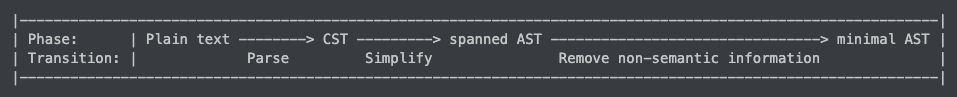

# Glossary

Here are some phrases and abbreviations
we use when talking about Zo.
The definitions are not guaranteed to agree
with the ordinary definitions.

- app: (function) application
- AST: abstract syntax tree.

  ASTs are divided into _families_
  depending on what kind of auxiliary data
  they hold.
  Here are the AST families:

  - minimal AST: Minimal AST nodes have no auxiliary data.

  - spanned AST: Each node of a spanned AST stores
    the node's span in its auxiliary data.

- auxiliary data: AST data that does not determine
  a node's semantic value.
  One example might include spans.
  Another example might include a node's type.

- CST: concrete syntax tree.
  The parser constructors this tree.
  The tree is later converted into a spanned AST.

- deb: De Bruijn index

- digest: the output of a hash algorithm.
  Unless otherwise specified, "digest" refers to
  a SHA256 digest.

- ind: inductive data type definition

- minimal AST: An AST that
  **only contains semantically relevant information.**
  This implies that any two AST nodes are equal
  under Rust's `std::cmp::Eq` iff
  they are semantically equal under Zo's semantic rules.

- NG: no good - unacceptable. This is the opposite of OK.
- OK: okay - acceptable. This is the opposite of NG.
- RC: reference counted

- span: the location of a syntax tree node in the source code.
  For example, in the following source code...

  ```zo
  (for (Set0) 0)
  ```

  ...the `for` token has the span `(1, 4)`,
  since it starts at index `1` and continues
  up to but not including index `4`.

  Indices start from `0`.
  When counting, we think of strings as
  UTF-8 encoded byte sequences
  (as opposed to say, codepoint sequences, for example).
  So the `hi` in `😎hi` has the span `(4, 6)`,
  since `😎` is 4 bytes long.

- spanned AST: An AST that contains the span
  of each node
  (i.e., the start and end position of each node
  in the source code).

- tcon: type context
- vcon: variant constructor

## Pronunciation of fully capitalized phrases

You should read the fully capitalized phrases using their individual letters.
For example, you read "AST" as "ay ess tee".
As another example, you read "CST" as "see ess tee".

## Pronunciation of tcon and vcon

- "tee con"
- "vee con"

In general, the first letter is pronounced as a letter.
The "con" is pronounced like the English word (e.g., as in "pros and cons").

## Syntax tree progression

Here is an ASCII diagram:

```plaintext
|-------------------------------------------------------------------------------------------------------------|
| Phase:      | Plain text --------> CST ---------> spanned AST --------------------------------> minimal AST |
| Transition: |             Parse         Simplify               Remove non-semantic information              |
|-------------------------------------------------------------------------------------------------------------|
```

In case the diagram renders weirdly (e.g., due to line wrapping),
here is a photo:


